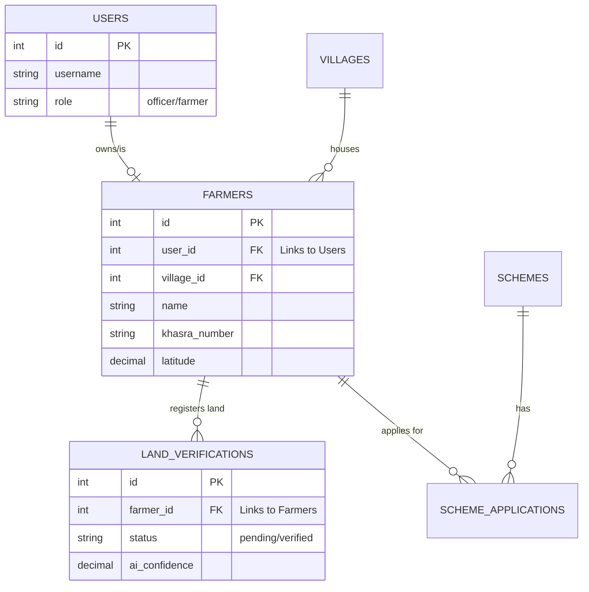

# 🗺️ Bhumi AI: System Logic & Data Flow Mapping

This guide explains how the different parts of the Bhumi AI platform talk to each other and how data moves through the system.

---

## 🏗️ High-Level Architecture

The system consists of three main services working in harmony:

1.  **Frontend (React/Vite)**: The user interface.
2.  **Backend API (Node.js/Express)**: The "brain" that handles data and authentication.
3.  **AI Service (Python/Flask)**: The intelligence layer for multilingual chat.
4.  **PostgreSQL (Docker)**: The persistent memory (database).

---

## 🔄 Core Data Flows

### 1. The "Life of a Land Registration" (Crucial Flow)
This is how data moves when a farmer registers their land:

1.  **Input**: Farmer enters Khasra Number and location on the **Frontend**.
2.  **Request**: Frontend sends an authorized `POST` request to `/api/farmers/land-details` with a **JWT Security Token**.
3.  **Backend Logic**: 
    *   **Auth Check**: Verifies the token to identify the `user_id`.
    *   **Farmer Match**: Checks if a Farmer record already exists for this `user_id`.
    *   **Data Merge**: If no farmer exists, it **automatically creates one** using the user's name. If it exists, it **updates** it with the new land details.
    *   **Verification**: Creates a new record in the `land_verifications` table with a mock AI confidence score.
4.  **Persistence**: Data is saved in the **PostgreSQL** database.
5.  **Sync**: The **Admin Dashboard** (which polls every 30s) detects the new counts and updates the UI instantly.

### 2. AI Chatbot Interaction
1.  **User**: Types a message in the chatbox.
2.  **Backend Proxy**: Frontend sends the message to the Backend API.
3.  **Intelligence Layer**: Backend forwards the request to the **AI Service (Port 5000)**.
4.  **Processing**: The Python service uses OpenAI (or fallback rules) to generate a response in the user's language.
5.  **Response**: The reply travels back: AI Service → Backend → Frontend → User.

---

## 📊 Database Mapping (ER Diagram Logic)

Here is how the tables are connected:

---

## 🧩 Key Component Mapping

| URL / Route | Path in Code | Responsibility |
| :--- | :--- | :--- |
| **`/api/auth`** | `backend/src/routes/auth.ts` | Handles Login/Registration and JWT issuance. |
| **`/api/farmers`** | `backend/src/routes/farmers.ts` | The core logic for land registration and identity. |
| **`/api/dashboard`**| `backend/src/routes/dashboard.ts`| Pulls live counts from across all tables. |
| **`DashboardPage`** | `frontend/src/pages/DashboardPage.tsx` | Auto-refreshes to show real-time changes. |
| **`api.ts`** | `frontend/src/utils/api.ts` | Centralizes all communication rules (base URL, headers). |

---

## 🔒 Security Logic (JWT Flow)
1.  **Login**: User provides credentials.
2.  **Issue**: Server sends back an `access_token`.
3.  **Store**: Frontend saves token in `localStorage`.
4.  **Attach**: For every subsequent request, the Frontend automatically attaches the token in the `Authorization` header.
5.  **Verify**: The Backend `authenticateToken` middleware checks this token before allowing any data to be saved.

---
*This mapping ensures that as the project grows, any developer or stakeholder can see exactly how the "plumbing" of the application works.*
